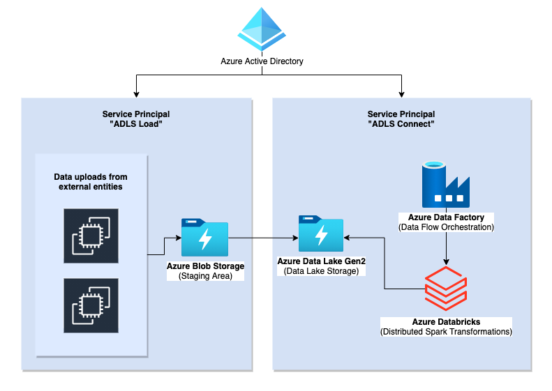

# Azure Spark Data Lake 
### Infrastructure as Code with Terraform



With this repository you create an infrastructure on Azure. You will create a data lake ([ADLS Gen2](https://docs.microsoft.com/en-us/azure/storage/blobs/data-lake-storage-introduction)) to store data, a databricks environment to process data with Spark and a data factory to orchestrate etl jobs. 

### Overview of the files and resources

For every resource there is a separate file. Everything related to storage is, for example, stored in the file `/src/storage.tf`. When you run the terraform commands, terraform will automatically consider every single `.tf` file. 

- __main.tf:__ Set up all Terraform providers. Create a resource group that holds the whole infrastructure.
- __active_directory.tf:__ Create [service principals](https://docs.microsoft.com/en-us/azure/active-directory/develop/app-objects-and-service-principals) that can authenticate to the data lakes.
- __storage.tf:__ Create a storage account for external suppliers. They can upload all files to that storage account. Create the main data lake for all ETL processes.
- __databricks.tf:__ Create the databricks workspace and two Spark clusters.
- __data_factory.tf:__ Create an Azure Data Factory resource and connect all previous resources to it.
- __locals.tf:__ Manage constant variables in this file. 

I did neither yet create the `variables.tf` file nor the `terraform.tfvars` file. You can of course create those files, too. 

### How to Build the Infrastructure

Make sure that you have the [azure CLI](https://docs.microsoft.com/en-us/cli/azure/install-azure-cli) and the [Terraform CLI](https://learn.hashicorp.com/tutorials/terraform/install-cli) installed. Check if you have both installed:

```zsh
# Check if you have installed the azure cli
❯ az --version
azure-cli 2.26.0 *

# Check if you have installed the terraform cli
❯ t --version
Terraform v1.0.0
```

Then, login to azure from your terminal. Execute `az login` in your command line. You will be forwarded to your browser where you can login to Azure. 

```zsh
az login
```

After you have authenticated to Azure, you can start using terraform. Make sure that you are in the `/src/` folder, and then run your terraform commands. 

```zsh
# Change directory to /src/
cd src

# Initialize terraform
terraform init

# Check your planned modifications
terraform plan

# Build your infrastructure
terraform apply
```

### Create a remote backend

Before you use the code in src, we advise you to first create a [remote backend](https://www.terraform.io/docs/language/settings/backends/remote.html).  

Please go to [/pre_conditions/create_remote_backend/](./pre_conditions/create_remote_backend/README.md) to first set up your remote backend. Terraform is based on a "state file". Terraform will store all the resources it creates on your cloud inside the state file. This state file is usually named `terraform.tfstate`. If you are more than one developer working on the infrastructure, you need to share that state file with your fellow developers. The sharing is happening in the "remote backend", which is simply a cloud storage that hosts the `terraform.tfstate` file. If you follow the instructions, you will create a separate resource group just to create a storage account with a container where you will eventually store your state file. 


### How to manage different environments

There are generally two ways how you can manage different environments. The two ways to manage envs are:

1. workspaces (e.g. `terraform workspace new dev`)
2. directory-based

Here is a great explanation of both approaches: [HashiCorp Learn: Separate Development and Production Environments](https://learn.hashicorp.com/tutorials/terraform/organize-configuration?in=terraform/modules)

### Important notes

- Never change infrastructure on the GUI / manually, but always use terraform. Otherwise, you will have drift which means that the actual environment looks different to what terraform expects.
- Only use terraform commands inside the environment directory.

### Questions

If you have questions, feel free to contact David Kuda, david.kuda@alexanderthamm.com. 